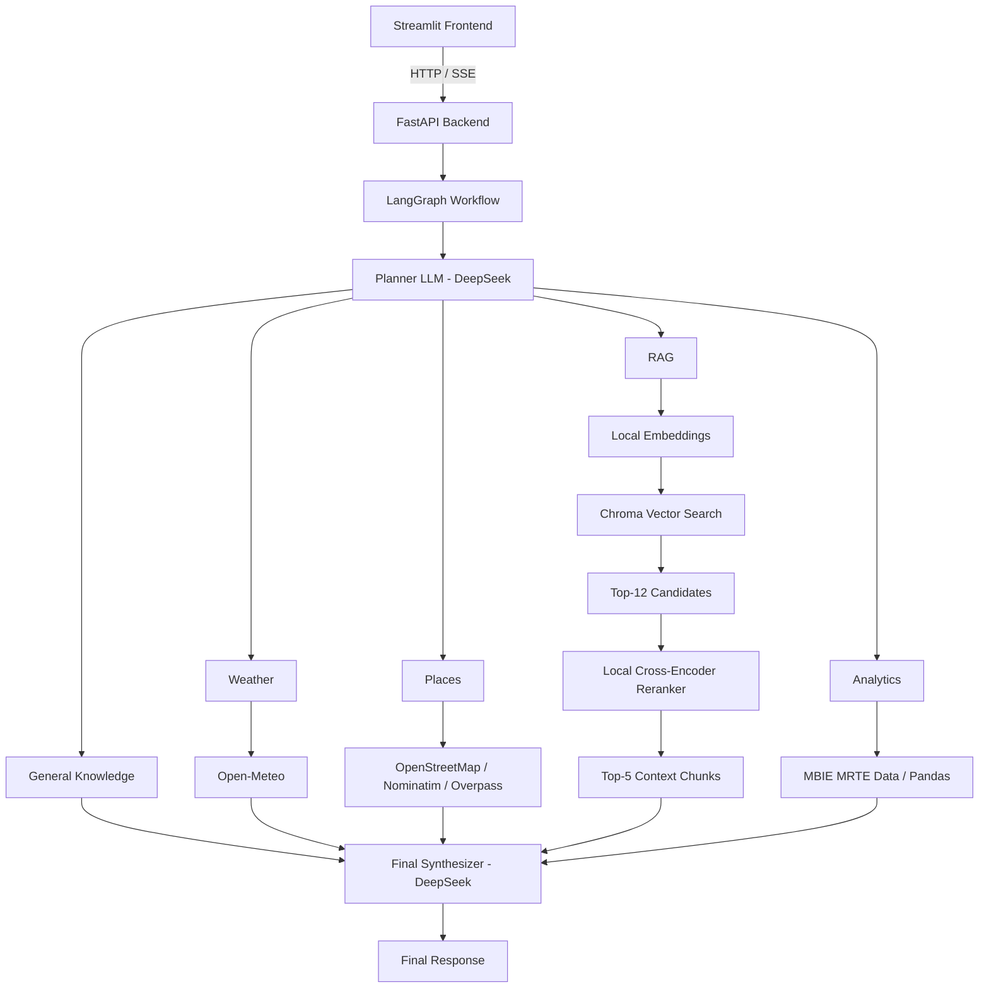

# Agentic Travel Assistant for New Zealand

An agentic AI travel assistant for New Zealand built with **LangGraph, RAG, live APIs, tourism analytics, local reranking, FastAPI, and Streamlit**.

The system dynamically decides whether a user request should be answered using general LLM knowledge, live weather data, place search, a local travel knowledge base, structured tourism data, or a combination of multiple services.

**Planner Routing Accuracy: 95% · End-to-End Success Rate: 90%**

---

## Overview

Traditional LLM applications often send every question directly to one model.

This project takes a different approach.

A **LangGraph planner** first analyses the user's request and decides which information sources are required. The selected services are executed, and their outputs are combined by a final LLM synthesizer.

The current system supports:

- General travel knowledge
- Live weather forecasts
- Restaurant and attraction search
- Retrieval-Augmented Generation (RAG)
- Local cross-encoder reranking
- Tourism spending analytics
- Multi-tool requests
- Multi-turn conversation memory
- Streaming responses
- Persistent chat history

The project was built as a practical exploration of **agentic AI system design**, with particular focus on routing, grounding, retrieval quality, structured data integration, and evaluation.

---

## System Architecture



---

## Key Features

### Agentic Service Routing

The planner identifies the type of information required and selects one or more services.

Available services:

| Service | Purpose |
|---|---|
| `general` | Stable general knowledge |
| `weather` | Current and future weather |
| `places` | Restaurants, attractions and nearby places |
| `rag` | Destination-specific knowledge from local documents |
| `analytics` | Structured tourism spending analysis |

Example:

```text
User:
What is the weather in Queenstown tomorrow
and recommend some restaurants there?

Planner:
weather + places
```

The architecture allows multiple services to be used within a single request.

---

### Live Weather

Weather information is retrieved through **Open-Meteo** rather than generated from LLM knowledge.

Supported examples include:

```text
What will the weather be tomorrow in Auckland?
```

```text
Will it rain in Queenstown tomorrow?
```

```text
Check the weather tomorrow in Auckland
and tell me whether Waiheke Island would be suitable.
```

This keeps time-sensitive information separate from static model knowledge.

---

### Restaurant and Attraction Search

The Places service uses OpenStreetMap-based data sources:

- Nominatim
- Overpass API

It supports searches for:

- Restaurants
- Attractions
- Museums
- Viewpoints
- Places to eat
- Places to visit

Example:

```text
Recommend some restaurants in Auckland.
```

The system avoids inventing information such as ratings, exact prices, or availability when the underlying source does not provide it.

---

## Retrieval-Augmented Generation

The project includes a local travel knowledge base for:

- Auckland
- Queenstown

The documents contain destination-specific information including:

- Major areas and neighbourhoods
- Attractions
- Islands and beaches
- Hiking and outdoor activities
- Family travel
- Transport guidance
- Seasonal considerations
- Suggested itineraries
- Traveller-type recommendations

Example:

```text
According to the travel knowledge base,
what is the difference between Queenstown and Wanaka?
```

### RAG Pipeline

```text
User Question
      ↓
Local Embedding Model
      ↓
Chroma Vector Search
      ↓
Top-12 Candidate Chunks
      ↓
Local Cross-Encoder Reranker
      ↓
Top-5 Context Chunks
      ↓
Final LLM Synthesizer
```

The first retrieval stage is designed for **recall**, while the reranker improves **precision** before context is sent to the LLM.

---

## Local Embeddings and Reranking

### Embedding Model

Embeddings are generated locally using:

```text
qwen3-embedding:4b
```

through **Ollama**.

This keeps embedding generation local and avoids an additional paid embedding API.

### Reranker

Candidate documents are reranked using:

```text
BAAI/bge-reranker-base
```

Current retrieval configuration:

```text
Vector retrieval: Top 12
Reranked context: Top 5
```

The reranker runs locally, so improving retrieval quality does not require an additional LLM API call.

---

## Why RAG Is Not Used for Every Question

The system intentionally separates **general knowledge** from **document-grounded knowledge**.

For example:

```text
Is Queenstown in the South Island?
```

does not require RAG.

However:

```text
According to the travel knowledge base,
what is the difference between Waiheke Island
and Rangitoto Island?
```

is routed to the local knowledge base.

This reduces unnecessary retrieval and gives each information source a clearer responsibility.

---

## Tourism Analytics

The project integrates structured tourism data from the **MBIE Monthly Regional Tourism Estimates (MRTE)** dataset.

Supported operations include:

- Total visitor spending
- Region comparison
- Region ranking
- Top-N regions
- Spending trends
- Visitor-type filtering
- Visitor-origin filtering
- Product-category filtering

Example:

```text
How much did international visitors spend
in Auckland in July 2026?
```

Numerical questions are calculated programmatically using structured data rather than asking the LLM to generate numerical facts.

---

## Conversation Memory

The system supports contextual follow-up questions.

Example:

```text
User:
What will the weather be tomorrow in Auckland?

User:
What about the day after?
```

The planner can reuse the previous destination and interpret the new relative date.

Another example:

```text
User:
What is the weather in Auckland tomorrow?

User:
Can you recommend some restaurants there?
```

The second request reuses the destination but does **not** automatically reuse the previous weather service.

The system currently uses:

- LangGraph in-memory checkpoints for active sessions
- SQLite for persistent conversation history
- A limited recent-message window for planner context

---

## Streaming Responses

The FastAPI backend supports **Server-Sent Events (SSE)**.

The Streamlit frontend can display:

- Planner progress
- Service execution status
- Streaming answer tokens
- Services used
- Sources used
- Response time

This separates backend orchestration from frontend presentation while providing a more interactive user experience.

---

## Information Routing Strategy

Different information types are handled by different sources.

| Information Type | Source |
|---|---|
| Stable general facts | LLM general knowledge |
| Live weather | Open-Meteo |
| Restaurants and attractions | OpenStreetMap services |
| Curated destination guidance | Local RAG knowledge base |
| Numerical tourism statistics | MBIE MRTE analytics |
| Complex travel questions | Multiple services |

A central design principle of the project is:

> The LLM should not be the source of truth for information that can be obtained more reliably from APIs, documents, or structured datasets.

---

## Evaluation

The system includes both **planner-level** and **end-to-end** evaluation.

### Planner Routing Evaluation

The planner was evaluated on **20 representative queries** across:

- General knowledge
- Weather
- Places
- RAG
- Tourism analytics
- Multi-tool requests
- Follow-up questions

Result:

```text
Correct: 19 / 20
Routing Accuracy: 95.0%
```

Category results:

| Category | Result |
|---|---:|
| General | 3 / 3 |
| Weather | 3 / 3 |
| Places | 3 / 3 |
| RAG | 3 / 3 |
| Analytics | 3 / 3 |
| Multi-tool | 2 / 3 |
| Follow-up | 2 / 2 |

---

### End-to-End Evaluation

A second evaluation tested the complete workflow:

```text
Question
    ↓
Planner
    ↓
Tools / RAG / Analytics
    ↓
Final Synthesizer
    ↓
Final Answer
```

A total of **10 end-to-end cases** were executed.

Results:

| Metric | Result |
|---|---:|
| Routing Accuracy | 90% |
| Source Accuracy | 90% |
| Successful Cases | 90% |

The single unsuccessful case was an ambiguous multi-tool request.

The planner selected:

```text
weather + general
```

instead of the expected:

```text
weather + rag
```

This highlights a real routing boundary between general destination knowledge and retrieval-grounded travel guidance.

Evaluation results are stored in:

```text
evaluation/planner_results.csv
evaluation/e2e_results.csv
```

---

## Reranking Experiment

Before integrating reranking into the main Travel RAG system, a separate private-document experiment was performed using a dissertation as an isolated knowledge base.

The experiment compared:

```text
Vector Search Only
```

with:

```text
Vector Search
      ↓
Larger Candidate Set
      ↓
Cross-Encoder Reranking
      ↓
Final Top-K
```

The reranker moved the chunks that directly answered the query to higher positions.

This experiment motivated the use of local reranking in the main travel retrieval pipeline.

---

## Technology Stack

### AI / Agent

- Python
- LangGraph
- LangChain
- DeepSeek API

### RAG

- Chroma
- Ollama
- `qwen3-embedding:4b`
- `BAAI/bge-reranker-base`
- Sentence Transformers
- RecursiveCharacterTextSplitter

### External Data

- Open-Meteo
- OpenStreetMap
- Nominatim
- Overpass API
- MBIE Monthly Regional Tourism Estimates

### Backend

- FastAPI
- Server-Sent Events
- SQLite

### Frontend

- Streamlit

### Data Processing

- Pandas
- CSV
- JSON

---

## Project Structure

```text
agentic-travel-assistant-nz/
│
├── app/
│   ├── __init__.py
│   └── streamlit_app.py
│
├── data/
│   ├── processed/
│   │   └── Region-series.csv
│   │
│   └── raw/
│       ├── auckland.md
│       └── queenstown.md
│
├── evaluation/
│   ├── e2e_results.csv
│   ├── e2e_test_cases.py
│   ├── planner_results.csv
│   ├── run_e2e_eval.py
│   ├── run_planner_eval.py
│   ├── test_cases.py
│   └── test_dissertation_rag.py
│
├── src/
│   ├── api/
│   │   └── main.py
│   │
│   ├── data/
│   │   └── preprocess_mrte.py
│   │
│   ├── db/
│   │   └── database.py
│   │
│   ├── graph/
│   │   ├── nodes.py
│   │   ├── planner.py
│   │   ├── state.py
│   │   └── workflow.py
│   │
│   ├── rag/
│   │   ├── ingest.py
│   │   ├── reranker.py
│   │   └── retriever.py
│   │
│   ├── rag_eval/
│   │   ├── dissertation_ingest.py
│   │   ├── dissertation_retriever.py
│   │   └── reranker.py
│   │
│   ├── services/
│   │   ├── embeddings.py
│   │   └── llm.py
│   │
│   ├── tools/
│   │   ├── analytics.py
│   │   ├── places.py
│   │   └── weather.py
│   │
│   └── config.py
│
├── .gitignore
├── cli.py
├── README.md
└── requirements.txt
```

Generated vector databases, local SQLite chat history, IDE files, virtual environments, API secrets, and private dissertation files are excluded from version control.

---

## Installation

### 1. Clone the Repository

```bash
git clone https://github.com/lny926/agentic-travel-assistant-nz.git
cd agentic-travel-assistant-nz
```

### 2. Create a Virtual Environment

Windows:

```powershell
python -m venv .venv
.\.venv\Scripts\activate
```

macOS / Linux:

```bash
python -m venv .venv
source .venv/bin/activate
```

### 3. Install Dependencies

```bash
pip install -r requirements.txt
```

---

## Configure Ollama

Install Ollama and download the local embedding model:

```bash
ollama pull qwen3-embedding:4b
```

Make sure Ollama is running before using RAG.

---

## Configure DeepSeek

Set your DeepSeek API key as an environment variable.

Windows PowerShell:

```powershell
$env:DEEPSEEK_API_KEY="your_api_key"
```

macOS / Linux:

```bash
export DEEPSEEK_API_KEY="your_api_key"
```

---

## Build the Vector Store

The generated Chroma vector store is not committed to GitHub.

Build it locally from the travel knowledge documents:

```bash
python -m src.rag.ingest
```

Run this command again whenever the source travel documents change.

---

## Run the Application

### Start FastAPI

```bash
uvicorn src.api.main:app --reload
```

The API will normally be available at:

```text
http://127.0.0.1:8000
```

Health check:

```text
http://127.0.0.1:8000/health
```

### Start Streamlit

Open another terminal:

```bash
python -m streamlit run app/streamlit_app.py
```

---

## Optional CLI

The core LangGraph workflow can also be used without Streamlit:

```bash
python cli.py
```

The CLI supports multiple turns and starting a new conversation.

---

## Run the Evaluations

### Planner Evaluation

```bash
python -m evaluation.run_planner_eval
```

### End-to-End Evaluation

Start the FastAPI backend first, then run:

```bash
python -m evaluation.run_e2e_eval
```

Results are written to:

```text
evaluation/planner_results.csv
evaluation/e2e_results.csv
```

---

## Example Queries

### General Knowledge

```text
Is Queenstown in the South Island?
```

### Weather

```text
What will the weather be tomorrow in Auckland?
```

### Places

```text
Recommend some restaurants in Auckland.
```

### RAG

```text
According to the travel knowledge base,
what is the difference between Queenstown and Wanaka?
```

### Analytics

```text
How much did international visitors spend
in Auckland in July 2026?
```

### Multi-Tool

```text
What is the weather in Queenstown tomorrow
and recommend some restaurants there?
```

### Follow-Up

```text
User:
What will the weather be tomorrow in Auckland?

User:
What about the day after?
```

---

## Design Decisions

### Why not use RAG for every question?

RAG is most useful when an answer should be grounded in a specific source.

Stable general facts can be handled directly by the LLM without unnecessary vector retrieval.

### Why use APIs for weather?

Weather is time-sensitive.

A live API is a more appropriate information source than model training knowledge or static documents.

### Why use structured analytics instead of the LLM?

Tourism spending is numerical structured data.

The application calculates those values directly instead of relying on probabilistic LLM generation.

### Why use a reranker?

Embedding similarity provides useful recall, but the most relevant chunk is not always ranked first.

A cross-encoder reranker evaluates the query and candidate text together and improves final retrieval precision.

### Why run embeddings and reranking locally?

Local inference:

- reduces external API usage;
- avoids additional embedding and reranking API costs;
- provides greater control over the retrieval pipeline;
- is suitable for a portfolio-scale application.

---

## Current Limitations

This project is a portfolio prototype rather than a production travel platform.

Current limitations include:

- The travel RAG knowledge base currently focuses on Auckland and Queenstown.
- Public Overpass endpoints can have variable latency.
- OpenStreetMap data may not contain ratings, exact prices, or live availability.
- LangGraph checkpoints are currently in-memory for active backend sessions.
- Planner routing is not perfect on ambiguous multi-tool requests.
- Live opening hours, temporary closures, traffic conditions, and event data are outside the scope of the static RAG knowledge base.
- The current travel documents are designed primarily for RAG experimentation rather than as authoritative real-time tourism references.

---

## Future Improvements

Potential improvements include:

- Additional New Zealand destinations
- More authoritative curated travel documents
- Persistent LangGraph checkpoints
- Named-place lookup
- Improved restaurant and attraction ranking
- Result pagination and deduplication
- Hotel and flight integrations
- Conversation summarisation
- User travel preference profiles
- Observability and tracing
- Expanded retrieval evaluation
- Cloud deployment

---

## Key Takeaways

This project explored several practical AI engineering questions:

- When should an LLM answer directly?
- When should an agent call a tool?
- When is RAG useful?
- How should live and static information be separated?
- How can structured data reduce hallucination risk?
- How should multi-tool workflows be evaluated?
- How can retrieval quality be improved without adding another LLM API call?

One of the main lessons from the project is that an agent does not become better simply by adding more tools.

**Clear information boundaries, appropriate routing, grounding, and evaluation are more important than tool count.**

---

## Repository

GitHub:

```text
https://github.com/lny926/agentic-travel-assistant-nz
```

---

## License

This project was developed for personal portfolio and educational purposes.