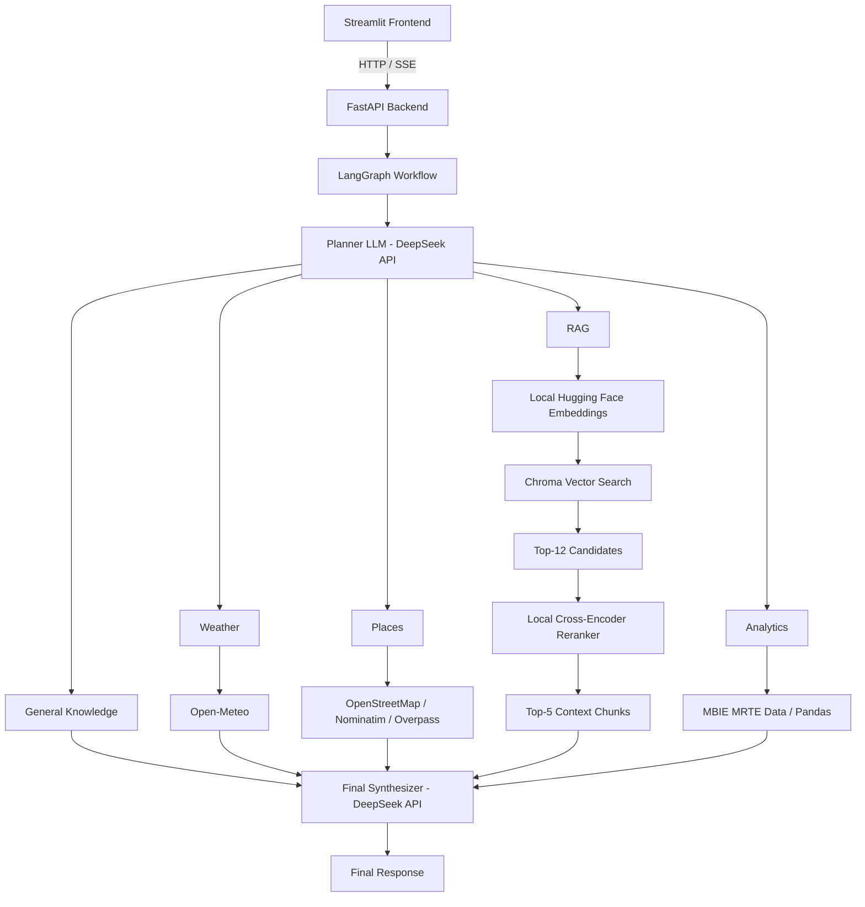

# Agentic Travel Assistant for New Zealand

An agentic AI travel assistant for New Zealand built with **LangGraph, RAG, live APIs, tourism analytics, FastAPI, Streamlit, local reranking, and Docker**.

The system dynamically decides whether a request should use general LLM knowledge, live weather, place search, a local travel knowledge base, structured tourism data, or multiple services together.

**Planner Routing Accuracy: 95% · End-to-End Success Rate: 90%**

---

## Demo

### Application Interface


### Multi-Tool Workflow


### Retrieval-Augmented Generation


### Tourism Analytics


---

## Overview

A **LangGraph planner** analyses each request and decides which information sources are required. The selected services are executed, and their outputs are combined by a final DeepSeek-based synthesizer.

Current capabilities include:

- General travel knowledge
- Live weather forecasts
- Restaurant and attraction search
- Retrieval-Augmented Generation (RAG)
- Local cross-encoder reranking
- Tourism spending analytics
- Multi-tool requests
- Multi-turn conversation memory
- SSE streaming responses
- Persistent chat history
- Docker-based local deployment

---

## System Architecture


```mermaid
flowchart TD
    A[Streamlit Frontend] -->|HTTP / SSE| B[FastAPI Backend]
    B --> C[LangGraph Workflow]
    C --> D[Planner LLM - DeepSeek API]

    D --> E[General Knowledge]
    D --> F[Weather]
    D --> G[Places]
    D --> H[RAG]
    D --> I[Analytics]

    F --> F1[Open-Meteo]
    G --> G1[OpenStreetMap / Nominatim / Overpass]

    H --> H1[Local Hugging Face Embeddings]
    H1 --> H2[Chroma Vector Search]
    H2 --> H3[Top-12 Candidates]
    H3 --> H4[Local Cross-Encoder Reranker]
    H4 --> H5[Top-5 Context Chunks]

    I --> I1[MBIE MRTE Data / Pandas]

    E --> J[Final Synthesizer - DeepSeek API]
    F1 --> J
    G1 --> J
    H5 --> J
    I1 --> J

    J --> K[Final Response]
```

For Docker deployment, Streamlit and FastAPI run in separate containers and communicate through the Docker Compose network.

---

## Key Features

### Agentic Routing

| Service | Purpose |
|---|---|
| `general` | Stable general knowledge |
| `weather` | Current and future weather |
| `places` | Restaurants, attractions and nearby places |
| `rag` | Destination-specific knowledge from local documents |
| `analytics` | Structured tourism spending analysis |

Example:

```text
User:
What is the weather in Queenstown tomorrow
and recommend some restaurants there?

Planner:
weather + places
```

### Live Weather

Weather information is retrieved through **Open-Meteo** rather than generated from model knowledge.

### Restaurant and Attraction Search

The Places service uses **Nominatim** and **Overpass API**. The system avoids inventing ratings, exact prices, or availability when the source does not provide them.

---

## Retrieval-Augmented Generation

The local travel knowledge base currently covers **Auckland** and **Queenstown**.

### RAG Pipeline

```text
User Question
      ↓
Local Hugging Face Embedding Model
      ↓
Chroma Vector Search
      ↓
Top-12 Candidate Chunks
      ↓
Local Cross-Encoder Reranker
      ↓
Top-5 Context Chunks
      ↓
Final LLM Synthesizer
```

Embeddings are generated locally with **Hugging Face / Sentence Transformers**.

Default embedding model:

```text
BAAI/bge-small-en-v1.5
```

Candidate documents are reranked locally using:

```text
BAAI/bge-reranker-base
```

This removes the need for a separate embedding API key or an Ollama installation.

---

## Tourism Analytics

The project integrates structured tourism data from the **MBIE Monthly Regional Tourism Estimates (MRTE)** dataset.

Supported operations include total visitor spending, region comparisons, rankings, trends, visitor-type filtering, visitor-origin filtering, and product-category filtering.

Numerical questions are calculated programmatically rather than generated by the LLM.

---

## Conversation Memory and Streaming

The system uses:

- LangGraph in-memory checkpoints for active sessions
- SQLite for persistent conversation history
- A limited recent-message window for planner context

The FastAPI backend supports **Server-Sent Events (SSE)** so the Streamlit frontend can display planner progress, service execution status, streaming answer tokens, sources, services used, and response time.

---

## Evaluation

### Planner Routing Evaluation

```text
Correct: 19 / 20
Routing Accuracy: 95.0%
```

| Category | Result |
|---|---:|
| General | 3 / 3 |
| Weather | 3 / 3 |
| Places | 3 / 3 |
| RAG | 3 / 3 |
| Analytics | 3 / 3 |
| Multi-tool | 2 / 3 |
| Follow-up | 2 / 2 |

### End-to-End Evaluation

| Metric | Result |
|---|---:|
| Routing Accuracy | 90% |
| Source Accuracy | 90% |
| Successful Cases | 90% |

Results are stored in:

```text
evaluation/planner_results.csv
evaluation/e2e_results.csv
```

---

## Technology Stack

### AI / Agent
- Python
- LangGraph
- LangChain
- DeepSeek API

### RAG
- Chroma
- Hugging Face / Sentence Transformers
- `BAAI/bge-small-en-v1.5`
- `BAAI/bge-reranker-base`
- RecursiveCharacterTextSplitter

### External Data
- Open-Meteo
- OpenStreetMap
- Nominatim
- Overpass API
- MBIE Monthly Regional Tourism Estimates

### Backend
- FastAPI
- REST APIs
- Server-Sent Events
- SQLite

### Frontend
- Streamlit

### Deployment
- Docker
- Docker Compose

### Data Processing
- Pandas
- CSV
- JSON

---

## Project Structure

```text
agentic-travel-assistant-nz/
│
├── app/
│   └── streamlit_app.py
├── assets/
├── data/
│   ├── processed/
│   └── raw/
├── evaluation/
├── src/
│   ├── api/
│   │   └── main.py
│   ├── db/
│   ├── graph/
│   ├── rag/
│   ├── services/
│   │   ├── embeddings.py
│   │   └── llm.py
│   ├── tools/
│   └── config.py
│
├── .dockerignore
├── .env.example
├── .gitignore
├── Dockerfile.backend
├── Dockerfile.frontend
├── docker-compose.yml
├── requirements.frontend.txt
├── requirements.txt
├── cli.py
└── README.md
```

Generated vector databases, local SQLite chat history, virtual environments, IDE files, API secrets, and private evaluation documents should not be committed.

---

# Quick Start with Docker

Docker is the recommended way to run the project.

## 1. Clone the repository

```bash
git clone https://github.com/lny926/agentic-travel-assistant-nz.git
cd agentic-travel-assistant-nz
```

## 2. Configure the DeepSeek API key

Copy `.env.example` to `.env`, then add:

```env
DEEPSEEK_API_KEY=your_deepseek_api_key_here
```

Do not commit `.env`.

## 3. Build the Docker images

```bash
docker compose build
```

The first build can take several minutes because the backend installs PyTorch, Sentence Transformers, Chroma, and other AI dependencies.

## 4. Build the local vector store

The generated Chroma vector store is not committed to GitHub.

Run once after cloning:

```bash
docker compose run --rm backend python -m src.rag.ingest
```

The local embedding and reranking models are downloaded automatically when first needed and cached by Docker.

## 5. Start the application

```bash
docker compose up
```

Open:

```text
Travel AI Assistant:
http://localhost:8501

FastAPI Docs:
http://localhost:8000/docs
```

No Ollama installation or separate embedding API key is required.

Stop the application with:

```bash
docker compose down
```

---

## Manual Installation

Docker is recommended, but the project can also run directly with Python.

### Create and activate a virtual environment

Windows:

```powershell
python -m venv .venv
.\.venv\Scripts\activate
```

macOS / Linux:

```bash
python -m venv .venv
source .venv/bin/activate
```

Install dependencies:

```bash
pip install -r requirements.txt
```

Create `.env`:

```env
DEEPSEEK_API_KEY=your_deepseek_api_key_here
```

Build the vector store:

```bash
python -m src.rag.ingest
```

Start FastAPI:

```bash
uvicorn src.api.main:app --reload
```

Start Streamlit in another terminal:

```bash
python -m streamlit run app/streamlit_app.py
```

---

## Run Evaluations

```bash
python -m evaluation.run_planner_eval
python -m evaluation.run_e2e_eval
```

---

## Example Queries

```text
What will the weather be tomorrow in Auckland?
```

```text
Recommend some restaurants in Auckland.
```

```text
According to the travel knowledge base,
what is the difference between Queenstown and Wanaka?
```

```text
How much did international visitors spend
in Auckland in July 2026?
```

```text
What is the weather in Queenstown tomorrow
and recommend some restaurants there?
```

---

## Design Decisions

### Why not use RAG for every question?
RAG is most useful when an answer should be grounded in a specific source. Stable general facts can be handled directly by the LLM.

### Why use APIs for weather and places?
These information sources can change over time, so live APIs are more appropriate than static model knowledge.

### Why use structured analytics?
Tourism spending is numerical structured data. The application calculates it directly instead of relying on probabilistic generation.

### Why use local embeddings and reranking?
Local inference avoids another paid API, removes the need for a second API key, and keeps the RAG pipeline reproducible.

### Why Docker?
Docker packages the application and its dependencies into reproducible environments. A user only needs Docker and a DeepSeek API key to run the application.

---

## Current Limitations

- The travel RAG knowledge base currently focuses on Auckland and Queenstown.
- Public Overpass endpoints can have variable latency.
- OpenStreetMap data may not contain ratings, exact prices, or live availability.
- LangGraph checkpoints are currently in-memory for active backend sessions.
- Planner routing is not perfect on ambiguous multi-tool requests.
- The first local embedding/reranking model load can take additional time.

---

## Future Improvements

- More New Zealand destinations
- More authoritative curated travel documents
- Persistent LangGraph checkpoints
- Improved place ranking
- Hotel and flight integrations
- Conversation summarisation
- User travel preference profiles
- Observability and tracing
- Expanded retrieval evaluation
- Automated CI/CD
- Microsoft Azure deployment

---

## Repository

```text
https://github.com/lny926/agentic-travel-assistant-nz
```

---

## License

This project was developed for personal portfolio and educational purposes.
