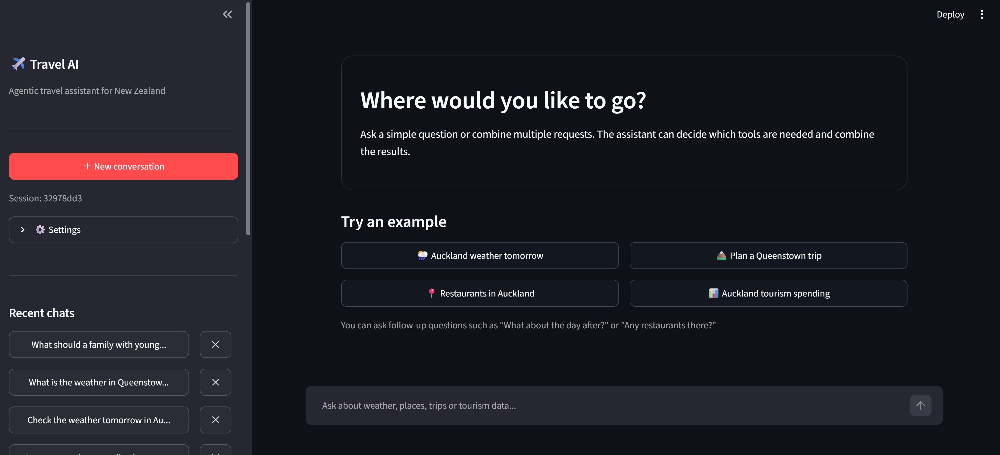
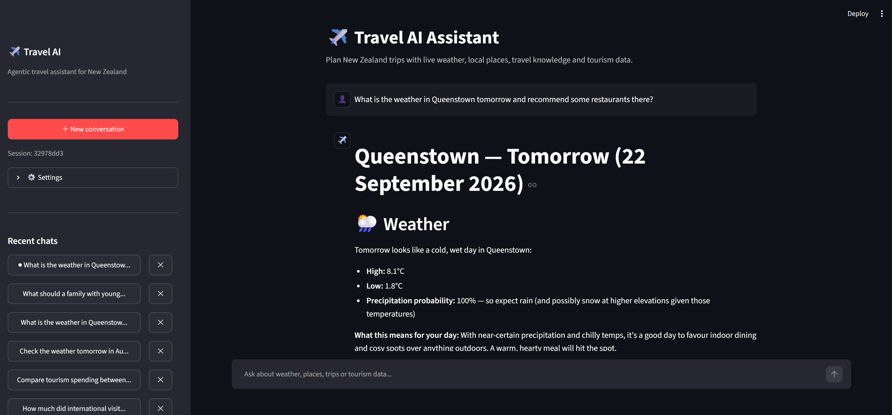
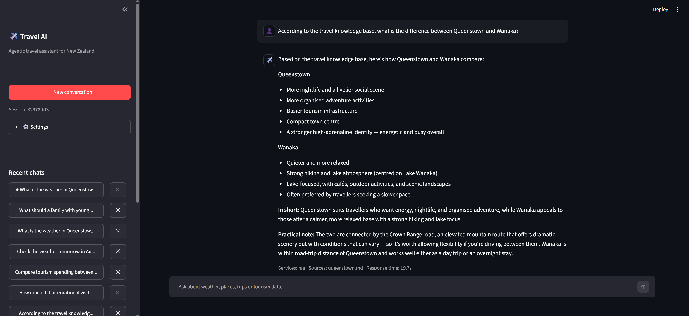
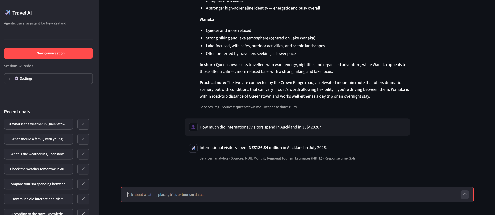
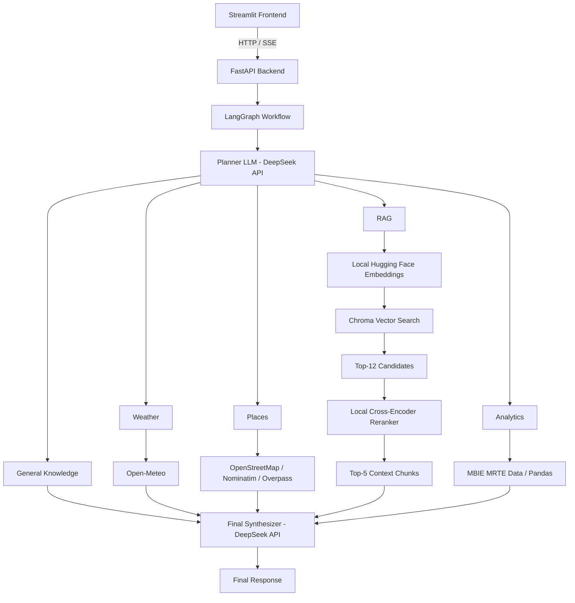

# 新西兰 Agentic Travel Assistant

一个面向新西兰旅行场景的 Agentic AI 助手，使用 **LangGraph、RAG、实时 API、旅游数据分析、FastAPI、Streamlit、本地重排序和 Docker** 构建。

系统会根据用户问题动态判断应该使用通用 LLM 知识、实时天气、地点搜索、本地旅行知识库、结构化旅游数据，或组合多个服务。

**Planner 路由准确率：95% · 端到端成功率：90%**

---

## Demo

### 应用界面


### 多工具工作流


### Retrieval-Augmented Generation


### 旅游数据分析


---

## 项目概述

系统首先通过 **LangGraph Planner** 分析用户请求，并判断需要哪些信息来源。随后执行对应服务，最后由 DeepSeek LLM 将结果综合成最终回答。

当前支持：

- 通用旅行知识
- 实时天气预报
- 餐厅和景点搜索
- Retrieval-Augmented Generation（RAG）
- 本地 Cross-Encoder Reranking
- 旅游消费数据分析
- Multi-Tool 请求
- 多轮对话记忆
- SSE 流式回答
- 持久化聊天记录
- Docker 本地部署

---

## 系统架构



Docker 部署时，Streamlit 前端和 FastAPI 后端分别运行在两个容器中，并通过 Docker Compose 内部网络通信。

---

## 主要功能

### Agentic Routing

| Service | 用途 |
|---|---|
| `general` | 稳定通用知识 |
| `weather` | 当前及未来天气 |
| `places` | 餐厅、景点及附近地点 |
| `rag` | 本地旅行文档中的目的地知识 |
| `analytics` | 结构化旅游消费数据分析 |

示例：

```text
User:
What is the weather in Queenstown tomorrow
and recommend some restaurants there?

Planner:
weather + places
```

### 实时天气

天气数据来自 **Open-Meteo**，而不是直接由 LLM 生成。

### 餐厅与景点搜索

Places 服务使用 **Nominatim** 和 **Overpass API**。如果底层数据没有评分、准确价格或实时可用性，系统不会主动编造。

---

## Retrieval-Augmented Generation

本地旅行知识库目前覆盖 **Auckland** 和 **Queenstown**。

### RAG Pipeline

```text
User Question
      ↓
Local Hugging Face Embedding Model
      ↓
Chroma Vector Search
      ↓
Top-12 Candidate Chunks
      ↓
Local Cross-Encoder Reranker
      ↓
Top-5 Context Chunks
      ↓
Final LLM Synthesizer
```

Embedding 通过 **Hugging Face / Sentence Transformers** 在本地生成。

默认模型：

```text
BAAI/bge-small-en-v1.5
```

候选文档使用以下模型进行本地重排序：

```text
BAAI/bge-reranker-base
```

因此不需要额外的 Embedding API Key，也不需要安装 Ollama。

---

## 旅游数据分析

项目集成了 **MBIE Monthly Regional Tourism Estimates（MRTE）** 数据。

支持游客消费、地区比较、排名、趋势、游客类型筛选、游客来源筛选和产品类别筛选。

数值类问题由程序直接计算，而不是让 LLM 生成数值。

---

## 对话记忆与流式回答

系统使用：

- LangGraph 内存 checkpoint 保存活跃 session
- SQLite 保存持久化聊天记录
- 有限长度近期消息作为 Planner 上下文

FastAPI 后端支持 **Server-Sent Events（SSE）**，Streamlit 前端可以展示 Planner 进度、服务状态、流式回答、Sources、Services 和 Response Time。

---

## Evaluation

### Planner Routing Evaluation

```text
Correct: 19 / 20
Routing Accuracy: 95.0%
```

| Category | Result |
|---|---:|
| General | 3 / 3 |
| Weather | 3 / 3 |
| Places | 3 / 3 |
| RAG | 3 / 3 |
| Analytics | 3 / 3 |
| Multi-tool | 2 / 3 |
| Follow-up | 2 / 2 |

### End-to-End Evaluation

| Metric | Result |
|---|---:|
| Routing Accuracy | 90% |
| Source Accuracy | 90% |
| Successful Cases | 90% |

结果保存在：

```text
evaluation/planner_results.csv
evaluation/e2e_results.csv
```

---

## 技术栈

### AI / Agent
- Python
- LangGraph
- LangChain
- DeepSeek API

### RAG
- Chroma
- Hugging Face / Sentence Transformers
- `BAAI/bge-small-en-v1.5`
- `BAAI/bge-reranker-base`
- RecursiveCharacterTextSplitter

### External Data
- Open-Meteo
- OpenStreetMap
- Nominatim
- Overpass API
- MBIE Monthly Regional Tourism Estimates

### Backend
- FastAPI
- REST APIs
- Server-Sent Events
- SQLite

### Frontend
- Streamlit

### Deployment
- Docker
- Docker Compose

### Data Processing
- Pandas
- CSV
- JSON

---

## 项目结构

```text
agentic-travel-assistant-nz/
│
├── app/
│   └── streamlit_app.py
├── assets/
├── data/
│   ├── processed/
│   └── raw/
├── evaluation/
├── src/
│   ├── api/
│   │   └── main.py
│   ├── db/
│   ├── graph/
│   ├── rag/
│   ├── services/
│   │   ├── embeddings.py
│   │   └── llm.py
│   ├── tools/
│   └── config.py
│
├── .dockerignore
├── .env.example
├── .gitignore
├── Dockerfile.backend
├── Dockerfile.frontend
├── docker-compose.yml
├── requirements.frontend.txt
├── requirements.txt
├── cli.py
└── README.md
```

生成的 Vector Store、本地 SQLite 聊天记录、虚拟环境、IDE 文件、API Secret 和私人评估文档不应上传到版本控制。

---

# Docker 快速启动

推荐使用 Docker 运行项目。

## 1. Clone Repository

```bash
git clone https://github.com/lny926/agentic-travel-assistant-nz.git
cd agentic-travel-assistant-nz
```

## 2. 配置 DeepSeek API Key

将 `.env.example` 复制为 `.env`，然后填写：

```env
DEEPSEEK_API_KEY=your_deepseek_api_key_here
```

不要将 `.env` 上传到 GitHub。

## 3. 构建 Docker Image

```bash
docker compose build
```

第一次构建可能需要几分钟，因为 Backend 会安装 PyTorch、Sentence Transformers、Chroma 等 AI 依赖。

## 4. 构建本地 Vector Store

生成后的 Chroma Vector Store 不上传到 GitHub。

第一次 clone 后运行：

```bash
docker compose run --rm backend python -m src.rag.ingest
```

Embedding 和 Reranker 模型第一次使用时会自动下载，并由 Docker 缓存。

## 5. 启动应用

```bash
docker compose up
```

打开：

```text
Travel AI Assistant:
http://localhost:8501

FastAPI Docs:
http://localhost:8000/docs
```

用户不需要安装 Ollama，也不需要额外的 Embedding API Key。

停止应用：

```bash
docker compose down
```

---

## 手动安装

也可以不用 Docker，直接使用 Python。

Windows：

```powershell
python -m venv .venv
.\.venv\Scripts\activate
```

macOS / Linux：

```bash
python -m venv .venv
source .venv/bin/activate
```

安装依赖：

```bash
pip install -r requirements.txt
```

创建 `.env`：

```env
DEEPSEEK_API_KEY=your_deepseek_api_key_here
```

构建 Vector Store：

```bash
python -m src.rag.ingest
```

启动 FastAPI：

```bash
uvicorn src.api.main:app --reload
```

另开 Terminal 启动 Streamlit：

```bash
python -m streamlit run app/streamlit_app.py
```

---

## 运行 Evaluation

```bash
python -m evaluation.run_planner_eval
python -m evaluation.run_e2e_eval
```

---

## 示例问题

```text
What will the weather be tomorrow in Auckland?
```

```text
Recommend some restaurants in Auckland.
```

```text
According to the travel knowledge base,
what is the difference between Queenstown and Wanaka?
```

```text
How much did international visitors spend
in Auckland in July 2026?
```

```text
What is the weather in Queenstown tomorrow
and recommend some restaurants there?
```

---

## 设计选择

### 为什么不是所有问题都使用 RAG？
只有需要特定文档 grounding 的问题才需要 RAG。稳定通用知识不必每次进行向量检索。

### 为什么天气和地点使用 API？
这些信息会随时间变化，因此实时 API 比静态模型知识更合适。

### 为什么旅游数据使用结构化分析？
旅游消费属于数值数据，程序直接计算比让 LLM 生成数值更可靠。

### 为什么使用本地 Embedding 与 Reranker？
本地推理避免额外 API 成本和第二个 API Key，同时让 RAG Pipeline 更容易复现。

### 为什么使用 Docker？
Docker 把应用与依赖封装成可复现环境。用户只需要 Docker 和自己的 DeepSeek API Key 即可运行项目。

---

## 当前限制

- RAG 知识库目前主要覆盖 Auckland 和 Queenstown。
- 公共 Overpass Endpoint 可能有延迟波动。
- OpenStreetMap 数据不一定包含评分、准确价格或实时可用性。
- 活跃 session 的 LangGraph checkpoint 当前保存在内存中。
- Planner 在少数模糊 Multi-Tool 问题上可能路由错误。
- 第一次加载 Embedding / Reranker 模型需要额外时间。

---

## 后续改进

- 增加更多新西兰目的地
- 引入更多权威旅行资料
- Persistent LangGraph checkpoints
- 改进地点排序
- 酒店和航班集成
- 对话摘要
- 用户旅行偏好
- Observability / Tracing
- 扩展 Retrieval Evaluation
- 自动化 CI/CD
- Microsoft Azure 部署

---

## Repository

```text
https://github.com/lny926/agentic-travel-assistant-nz
```

---

## License

本项目用于个人 Portfolio 和教育用途。
